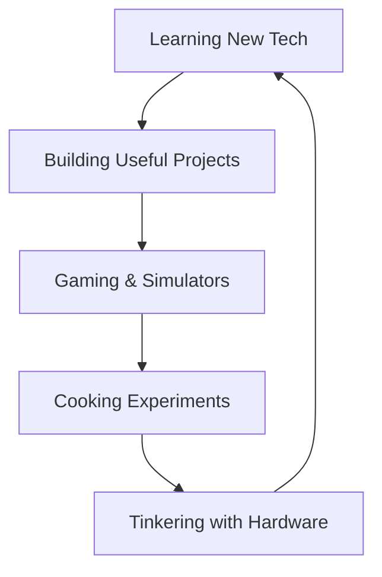

# 👋 Hey there, I'm Alvini! 

<div align="center">
  
  
  
</div>

---

## 🎮 About Me

```yaml
name: Alvini
location: 🇳🇱 Netherlands
occupation: Software Development Student
passion: "Everything tech-related!"
current_mission: "Building useful projects and learning new technologies"
```

I'm a passionate software development student from the Netherlands who loves diving into all things tech! When I'm not coding, you'll find me:
- 🎮 Building virtual cities and managing tycoon empires
- 👨‍🍳 Cooking up delicious meals (both in the kitchen and in code!)
- 🔧 Tinkering with computers and tech gadgets
- 💻 Working on projects that are actually useful to me

---

## 🛠️ Tech Stack & Tools

<div align="center">


</div>

---

## 🎯 Current Projects

<div align="center">



</div>

---

## 🎮 Gaming Corner

<div align="center">

### My Favorite Game Genres:
🏗️ **City Builders** | 🏢 **Tycoons** | 🎮 **Simulators**

*"Why build real cities when you can build virtual ones without permits?"* 😄

</div>

---

## 📊 GitHub Stats

<div align="center">


</div>

---

## 🌐 Connect With Me

<div align="center">

[](https://www.alvnx.xyz)
[](https://alvin-zilverstand.nl)
[](https://www.tiktok.com/@alvinzilverstand)

</div>

---

## 🎯 What I'm Working On

- 🔨 **Useful Projects**: Building tools and applications that actually make my life easier
- 📚 **Learning**: Exploring new technologies and frameworks
- 🎮 **Gaming**: When I'm not coding, I'm probably managing a virtual empire
- 👨‍🍳 **Cooking**: Both real food and code recipes!

---

## 🎪 Fun Facts

<div align="center">

```ascii
  ╔══════════════════════════════════════╗
  ║           FUN FACTS ABOUT ME         ║
  ╠══════════════════════════════════════╣
  ║ 🎮 I prefer virtual cities over      ║
  ║    real ones (no traffic jams!)       ║
  ║ 👨‍🍳 I cook both food and code         ║
  ║ 🔧 I tinker with everything tech     ║
  ║ 🇳🇱 Living in the Netherlands          ║
  ║ 💻 Passionate about all things tech  ║
  ╚══════════════════════════════════════╝
```

</div>

---

## 🚀 Quick Stats

<div align="center">


</div>

---

<div align="center">

### Thanks for visiting! 👋

*"In a world full of bugs, be the debugger!"* 🐛➡️✨

</div> 
